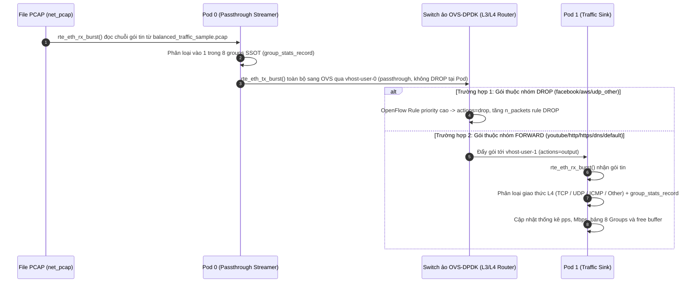

# K8s-DPDK-L3-Bridge: Chuyển mạch và Định tuyến Gói tin L3 qua OVS-DPDK trong Kubernetes

Dự án này được thiết kế nhằm xây dựng, thử nghiệm và đánh giá công nghệ **mạng hiệu năng cao (High-Performance Networking)** trong môi trường **Kubernetes**, kết hợp sức mạnh của **DPDK (Data Plane Development Kit)** và **Open vSwitch (OVS-DPDK)** để xử lý, phân loại và chuyển mạch lưu lượng mạng thực tế (PCAP Replay) ở tầng Layer 3 với độ trễ cực thấp và thông lượng hàng triệu gói tin mỗi giây (Mpps).

---

## 📌 Mục lục
1. [Mục tiêu và Bối cảnh Kỹ thuật](#1-mục-tiêu-và-bối-cảnh-kỹ-thuật)
2. [Kiến trúc Tổng thể Hệ thống](#2-kiến-trúc-tổng-thể-hệ-thống)
3. [Các Khái niệm Cốt lõi Cần Nắm](#3-các-khái-niệm-cốt-lõi-cần-nắm)
4. [Vòng đời Gói tin (Packet Life Cycle)](#4-vòng-đời-gói-tin-packet-life-cycle)
5. [Cấu trúc Thư mục Dự án](#5-cấu-trúc-thư-mục-dự-án)
6. [Chi tiết Kỹ thuật Các Module Mã nguồn](#6-chi-tiết-kỹ-thuật-các-module-mã-nguồn)
7. [Tối ưu hóa Vị trí Lưu trữ tại /home/app](#7-tối-ưu-hóa-vị-trí-lưu-trữ-tại-homeapp)
8. [Hướng dẫn Chạy Thực tế Từng Bước](#8-hướng-dẫn-chạy-thực-tế-từng-bước)
9. [Xử lý Sự cố & Câu hỏi Thường gặp (FAQ)](#9-xử-lý-sự-cố--câu-hỏi-thường-gặp-faq)

---

## 1. Mục tiêu và Bối cảnh Kỹ thuật

### 1.1. Vấn đề của mạng Kubernetes truyền thống
Trong mạng Kubernetes tiêu chuẩn (sử dụng Flannel, Calico, hoặc kube-proxy dựa trên iptables/IPVS):
- Mọi gói tin truyền nhận giữa các Pod đều phải đi qua **Linux Kernel Network Stack**.
- Quá trình này gây ra nhiều lần **sao chép bộ nhớ (Memory Copy)**, **ngắt phần cứng (Hardware Interrupts)** và **chuyển ngữ cảnh (Context Switch)** giữa User-space và Kernel-space.
- Giới hạn thông lượng thường chỉ đạt vài trăm ngàn gói tin mỗi giây (kpps), không đáp ứng được các ứng dụng viễn thông 5G (UPF), NFV/VNF, phân tích an ninh mạng tốc độ cao hoặc trung tâm dữ liệu AI/HPC.

### 1.2. Giải pháp của dự án
- **Bypass hoàn toàn Linux Kernel:** Sử dụng thư viện **DPDK** để đưa việc đọc và xử lý gói tin lên thẳng Userspace thông qua cơ chế Polling (PMD - Poll Mode Driver).
- **Phát lại lưu lượng thực tế (PCAP Replay):** Pod 0 sử dụng DPDK `net_pcap` driver để đọc liên tục dữ liệu gói tin thực tế từ file `.pcap` (`balanced_traffic_sample.pcap`) với chế độ `infinite_rx=1`, mô phỏng tải lưu lượng mạng chân thực thay vì sinh gói giả lập đơn giản.
- **Phân loại & Lọc gói Layer 3 (L3 ACL/Router):** Pod 0 tích hợp bảng định tuyến tĩnh dựa trên thuật toán LPM (Longest Prefix Match) để quyết định `FORWARD` hoặc `DROP` gói tin ngay tại ingress dựa trên dải IP đích.
- **Cơ chế vhost-user:** Hai Pod kết nối vào switch ảo **OVS-DPDK** trên Host qua Unix Domain Sockets và bộ nhớ chia sẻ Hugepages (Zero-copy).
- **Phân tích lưu lượng tốc độ cao (Traffic Sink & Inspector):** Pod 1 tiếp nhận luồng gói tin đã qua xử lý từ OVS, phân loại giao thức (TCP, UDP, ICMP...) và đo đạc thông lượng thời gian thực (pps, Mbps).

---

## 2. Kiến trúc Tổng thể Hệ thống

```text
+------------------------------------------+        +------------------------------------------+
|            Pod 0: dpdk-pod0              |        |             Pod 1: dpdk-pod1             |
|       (PCAP Streamer & Passthrough)      |        |       (High-Speed Traffic Sink)          |
|                                          |        |                                          |
|  [File PCAP: balanced_traffic_sample.pcap] |      |                                          |
|                 │                        |        |                                          |
|       DPDK Port 0 (net_pcap)             |        |                                          |
|                 ▼                        |        |                                          |
|  +------------------------------------+  |        |  +------------------------------------+  |
|  |  Group Stats (8 groups SSOT):      |  |        |  |  Group Stats (8 groups SSOT):      |  |
|  |  fb/aws DROP | yt/http/https/dns FWD |  |        |  |  chỉ còn 6 nhóm FORWARD          |  |
|  +------------------------------------+  |        |  +------------------------------------+  |
|  | TX toàn bộ sang Port 1 (Virtio)    |  |        |  | main.c (pps/Mbps + groups + HW)  |  |
|  +------------------------------------+  |        |  +------------------------------------+  |
|  |     common/ (dpdk_init, group_stats)|  |        |  |     common/ (dpdk_init, group_stats)|  |
|  +------------------------------------+  |        |  +------------------------------------+  |
|                 │                        |        |                    ▲                     |
|       DPDK Port 1 (virtio-user0)         |        |         DPDK Port 0 (virtio-user0)       |
+----------------─┼────────────────────────+        +────────────────────┼─────────────────────+
                  │                                                      │
            (Unix Socket)                                          (Unix Socket)
  /var/run/openvswitch/vhost-user-0                      /var/run/openvswitch/vhost-user-1
                  │                                                      │
+─────────────────┼──────────────────────────────────────────────────────┼─────────────────────+
| Pod: ovs-dpdk (Switch ảo OVS-DPDK chạy trong Pod - Zero-copy Shared Memory)                  |
|                                     Bridge: br-dpdk                                          |
|              Bảng route L3/L4 từ manifests/ovs_flows.conf (SSOT, 8 groups)                   |
|    [Port: vhost-user-0]  <==== OpenFlow L3/L4 Routing (DROP fb/aws/udp, FWD còn lại) ===>  [Port: vhost-user-1]     |
|    (dpdkvhostuserclient)                                             (dpdkvhostuserclient)   |
+----------------------------------------------------------------------------------------------+
```

---

## 3. Các Khái niệm Cốt lõi Cần Nắm

### 3.1. DPDK (Data Plane Development Kit)
DPDK là một bộ thư viện nguồn mở của Intel/Linux Foundation giúp tăng tốc tối đa việc xử lý gói tin mạng:
- **EAL (Environment Abstraction Layer):** Tầng trừu tượng hóa phần cứng, cấp phát CPU core affinity và quản lý bộ nhớ.
- **PMD (Poll Mode Driver):** Thay vì đợi ngắt phần cứng (interrupt-driven), DPDK chạy vòng lặp chủ động kiểm tra hàng đợi (polling loop), loại bỏ hoàn toàn độ trễ ngắt.
- **Mempool & Mbuf (`rte_mbuf`):** Quản lý vùng đệm gói tin cố định trong bộ nhớ, không tốn chi phí cấp phát động (`malloc`/`free`) khi mạng hoạt động.

### 3.2. Hugepages (Bộ nhớ trang lớn)
- Thông thường Linux quản lý bộ nhớ bằng các trang có kích thước 4 KB.
- Với lưu lượng hàng triệu gói tin, bảng dịch trang (TLB - Translation Lookaside Buffer) của CPU sẽ liên tục bị quá tải (TLB Miss).
- **Hugepages (2 MB):** Giảm kích thước bảng TLB xuống hàng ngàn lần, giúp CPU truy cập thẳng vào vùng đệm gói tin ở tốc độ tối đa. Dự án này cấp phát **1024 trang 2MB (2GB RAM)**.

### 3.3. vhost-user & Virtio-user
- **vhost-user:** Giao thức chia sẻ bộ nhớ (shared memory) giữa các tiến trình Userspace thông qua Unix Domain Socket theo chuẩn Virtio.
- **Virtio-user:** Một card mạng ảo do DPDK tạo ra bên trong Pod, kết nối trực tiếp với socket vhost-user của OVS trên Host mà không cần kernel can thiệp.

### 3.4. LPM (Longest Prefix Match)
- Giải thuật tìm kiếm địa chỉ IP chuẩn của các Router mạng.
- Khi gói tin đến, thuật toán so sánh địa chỉ IP đích với các subnet trong bảng luật. Subnet nào có độ dài prefix lớn nhất (ví dụ `/24` ưu tiên hơn `/16`) sẽ quyết định hành vi.

---

## 4. Vòng đời Gói tin (Packet Life Cycle)



---

## 5. Cấu trúc Thư mục Dự án

```text
K8s-DPDK-L3-Bridge/
├── CMakeLists.txt                  # Cấu hình build CMake chuẩn hóa cho toàn dự án
├── build/compile_commands.json       # (Sinh tự động) cấu hình Language Server cho VSCode / IDE
├── common/                         # THƯ MỤC DÙNG CHUNG (Hạ tầng DPDK & Bảng luật SSOT)
│   ├── dpdk_init.c / .h            # Khởi tạo EAL, mempool, cấu hình port virtio-user & queues
│   ├── group_stats.c / .h          # Module phân loại và thống kê theo 8 Groups SSOT
│   ├── group_stats_table.h         # Bảng luật C sinh tự động từ manifests/ovs_flows.conf
│   ├── l3_table.c / .h             # Giải thuật tra cứu LPM legacy
│   ├── hw_stats.c / .h             # In thống kê phần cứng cổng mạng (imissed/oerrors)
│   └── pkt_utils.h                 # Đồng hồ monotonic get_current_time_ns cho thống kê chu kỳ
├── data/                           # DỮ LIỆU GÓI TIN THỬ NGHIỆM
│   └── balanced_traffic_sample.pcap # File PCAP dùng runtime (mount vào Pod 0 qua hostPath)
├── pod0-forwarder/                 # ỨNG DỤNG POD 0 (PCAP Replayer & Passthrough)
│   ├── main.c                      # Logic Pod 0: Đọc PCAP + Thống kê 8 Groups + Passthrough sang OVS
│   └── Dockerfile                  # Đóng gói image pod0:latest
├── pod1-responder/                 # ỨNG DỤNG POD 1 (Traffic Sink & Inspector)
│   ├── main.c                      # Logic Pod 1: Nhận gói từ OVS + Thống kê 8 Groups + Đối soát lọc gói
│   └── Dockerfile                  # Đóng gói image pod1:latest
├── manifests/                      # KUBERNETES MANIFESTS & CẤU HÌNH OVS
│   ├── ovs_flows.conf              # Single Source of Truth (SSOT) cho 8 Groups và 16 Filter Rules
│   ├── ovs-pod.yaml                # Manifest Pod OVS-DPDK chạy vSwitch ảo trong K8s
│   ├── ovs-setup.sh                # Script tạo switch br-dpdk và nạp flows tự động từ ovs_flows.conf
│   ├── pod0.yaml                   # Manifest triển khai Pod 0 (mount PCAP data, hugepages, ovs socket)
│   └── pod1.yaml                   # Manifest triển khai Pod 1 (mount hugepages, ovs socket)
├── scripts/                        # BỘ SCRIPTS TỰ ĐỘNG HÓA TỪ A-Z
│   ├── 00_setup_app_env.sh         # Khởi tạo /home/app, cài K3s, Docker data-root, cấp Hugepages
│   ├── 01_setup_host.sh            # (Legacy) Cài OVS trên Host — KHÔNG dùng nữa, OVS chạy trong Pod
│   ├── gen_group_table.sh          # Sinh mã C group_stats_table.h từ manifests/ovs_flows.conf
│   ├── 03_build_all.sh             # Sinh mã C và biên dịch toàn bộ bằng CMake
│   ├── 04_build_docker.sh          # Build 2 Docker images và nạp vào K3s image store
│   ├── 05_deploy_k8s.sh            # Triển khai toàn bộ cụm K8s (ovs-dpdk, pod0, pod1)
│   ├── 06_verify_traffic.sh        # Kiểm tra thống kê pps, throughput và bảng 8 Groups đối chứng E2E
│   └── 07_stop_k8s.sh              # Dừng toàn bộ Pods và dọn socket vhost-user tồn đọng
├── tests/                          # UNIT TEST TỰ ĐỘNG
│   └── test_l3_table.c             # Kiểm thử offline bảng luật L3 (chạy không cần quyền root)
└── third_party/
    └── dpdk-24.11/                 # Thư viện DPDK 24.11 đã biên dịch sẵn trong workspace
```

---

## 6. Chi tiết Kỹ thuật Các Module Mã nguồn

### 6.1. `common/dpdk_init.c` & `common/dpdk_init.h`
Đóng gói toàn bộ logic cấu hình DPDK EAL và khởi tạo ports vào hàm dùng chung:
```c
bool init_dpdk_subsystem(int argc, char **argv, uint16_t *nb_ports, int *eal_consumed);
```
- Gọi `rte_eal_init()` để gán CPU cores và gắn kết các virtual devices (`net_pcap`, `virtio_user`).
- Cấp phát `rte_pktmbuf_pool_create` với mempool cố định trên Hugepages.
- Khởi tạo RX/TX queues và đưa các cổng vào chế độ Promiscuous.

### 6.2. `common/l3_table.c` & `common/l3_table.h` (Legacy, chỉ dùng cho unit test)
- Thuật toán LPM (Longest Prefix Match) giữ lại để kiểm thử offline và kể chuyện tiến hóa kiến trúc trong slide.
- Runtime chính thức **không dùng**: định tuyến L3/L4 thực thi trên OVS-DPDK theo `manifests/ovs_flows.conf`.

### 6.3. `pod0-forwarder/main.c` (PCAP Streamer & Passthrough)
- Nhận gói tin từ Port 0 (`net_pcap0`) thông qua `rte_eth_rx_burst()`.
- Phân loại mỗi gói vào 1 trong 8 groups SSOT (`group_stats_record()`, bảng C sinh từ `ovs_flows.conf`).
- Đẩy **toàn bộ** sang Port 1 (`virtio_user0`) vào OVS bằng `rte_eth_tx_burst()` — Pod không DROP gói nào (ngoại trừ TX ring đầy).
- Định kỳ mỗi giây in thống kê: `TX pps`, `Mbps`, `Total Sent` và `HW Stats (imissed/oerrors)`; mỗi 20 giây in bảng 8 Groups.

### 6.4. `pod1-responder/main.c` (Traffic Sink & Inspector)
- Nhận luồng gói tin chuyển tiếp từ OVS qua `rte_eth_rx_burst()` trên Port 0 (`virtio_user0`).
- Bóc tách L3/L4 header: Thống kê số lượng gói tin theo giao thức (`TCP`, `UDP`, `ICMP`, `Other`) và phân loại 8 Groups.
- Xuất log định kỳ đo lường thông lượng nhận thực tế (pps và Mbps) cùng bảng 8 Groups để đối soát với OVS.

---

## 7. Tối ưu hóa Vị trí Lưu trữ tại `/home/app`

Do phân vùng root (`/`) trên máy chỉ còn trống hạn chế, việc cài đặt Docker và Kubernetes thông thường sẽ làm tràn ổ đĩa hệ thống. Dự án giải quyết triệt để vấn đề này bằng cách chuyển toàn bộ dữ liệu nặng sang phân vùng **`/home` (còn trống dung lượng lớn)**:

```text
/home/app/
├── docker-data/          # data-root của Docker (toàn bộ images, build layers)
├── k8s-data/             # data-dir của K3s (database, pod volumes, manifests)
└── bin/                  # Nơi đặt binary k9s, kubectl
```

- **Docker (`/etc/docker/daemon.json`):** Cấu hình `"data-root": "/home/app/docker-data"`.
- **K3s Server:** Chạy với tham số `--data-dir=/home/app/k8s-data`.
- **Lợi ích:** Không tốn dung lượng của phân vùng root `/`, an toàn tuyệt đối cho hệ điều hành.

---

## 8. Hướng dẫn Chạy Thực tế Từng Bước

### Bước 1: Thiết lập Môi trường (Chỉ cần chạy 1 lần)
Mở terminal tại thư mục dự án và chạy với quyền root:

```bash
# 1. Cài đặt Docker, K3s, K9s tại /home/app và cấp 2GB Hugepages
sudo bash scripts/00_setup_app_env.sh
```

> **Lưu ý kiến trúc hiện tại:** OVS-DPDK chạy **trong Pod** (`manifests/ovs-pod.yaml`), không còn chạy service trên Host. `scripts/01_setup_host.sh` là legacy của kiến trúc cũ — không chạy nữa (nếu service host còn active, stop để tránh xung đột socket: `sudo systemctl stop openvswitch-switch`). Bridge `br-dpdk` và flows được `ovs-pod` tự nạp từ `manifests/ovs_flows.conf` qua `manifests/ovs-setup.sh` khi khởi động.

### Bước 2: Biên dịch Mã nguồn & Chạy Unit Test
Chạy ở quyền user thông thường:

```bash
# Biên dịch cả 2 ứng dụng DPDK bằng CMake
bash scripts/03_build_all.sh

# Chạy unit test offline kiểm tra bảng luật L3
./build/test_l3_table
```

### Bước 3: Đóng gói Docker Images
```bash
# Build 2 images: pod0:latest và pod1:latest và nạp vào K3s image store
bash scripts/04_build_docker.sh
```

### Bước 4: Triển khai lên Kubernetes (đúng thứ tự OVS trước để giữ handshake vhost-user)
```bash
# Deploy ovs-dpdk trước, sau đó Pod 1 (Sink) và Pod 0 (Streamer)
bash scripts/05_deploy_k8s.sh
```

### Bước 5: Kiểm tra Thống kê & Hiệu năng Trao đổi
```bash
# Xem bảng route OVS, thống kê DPDK và bảng 8 Groups đối chứng E2E
bash scripts/06_verify_traffic.sh
```

### Dừng cụm khi không dùng
```bash
# Xóa 3 Pods và dọn socket vhost-user tồn đọng
bash scripts/07_stop_k8s.sh
```

*Hoặc quan sát trực quan bằng K9s Dashboard:*
```bash
k9s
```
*(Trong giao diện K9s: Dùng phím mũi tên chọn `dpdk-pod0` hoặc `dpdk-pod1`, nhấn phím `l` để theo dõi luồng log trực tiếp).*

---

## 9. Xử lý Sự cố & Câu hỏi Thường gặp (FAQ)

### Q1: OVS chạy ở đâu? Dự án có mấy Pod?
- **Trả lời:** OVS-DPDK chạy **trong Pod** `ovs-dpdk` (`manifests/ovs-pod.yaml`, image Ubuntu mount OVS từ Host, share `/var/run/openvswitch` qua hostPath).
- Khi khởi động, Pod OVS tự chạy `manifests/ovs-setup.sh` để tạo bridge `br-dpdk`, 2 cổng vhost-user và nạp flows L3/L4 từ `manifests/ovs_flows.conf`.
- Tổng cộng 3 Pods: `ovs-dpdk` (switch) + `dpdk-pod0` (streamer) + `dpdk-pod1` (sink). Service OVS trên Host (nếu còn) phải stop để tránh xung đột socket.

### Q2: Tại sao Pod không nhận diện được socket `/var/run/openvswitch/vhost-user-X`?
- **Nguyên nhân:** Socket do Pod `ovs-dpdk` tạo ra ( Pod OVS phải chạy **trước** Pod DPDK). Nếu deploy sai thứ tự, Pod DPDK ở trạng thái `server` chờ mãi, OVS `client` báo `status=disconnected` và Pod0 `TX: 0 pps`.
- **Cách xử lý:** Deploy đúng thứ tự OVS → Pod1 → Pod0 (`05_deploy_k8s.sh` đã làm sẵn). Kiểm tra bằng: `kubectl exec ovs-dpdk -- ovs-vsctl get Interface vhost-user-0 status` phải ra `connected`.

### Q3: Làm sao để kiểm tra trạng thái Hugepages trên Host?
Chạy lệnh:
```bash
grep -i huge /proc/meminfo
```
Đảm bảo dòng `HugePages_Total` hiển thị ít nhất `1024` (tương đương 2GB RAM Hugepages 2MB).

### Q4: Muốn xóa toàn bộ Pod để chạy lại từ đầu thì làm thế nào?
Chạy lệnh (xóa cả 3 Pods, đúng thứ tự ngược với deploy):
```bash
bash scripts/07_stop_k8s.sh
# hoặc thủ công:
kubectl delete pod dpdk-pod0 dpdk-pod1 ovs-dpdk --force --grace-period=0
```
> Deploy lại **luôn bắt đầu từ OVS trước** (`05_deploy_k8s.sh` đã làm đúng thứ tự này) để handshake vhost-user không bị `disconnected`.

---

## 👨‍💻 Thông tin Tác giả & Giấy phép
- **Dự án:** K8s-DPDK-L3-Bridge
- **Môi trường thử nghiệm:** Ubuntu 24.04 LTS | DPDK 24.11 | Open vSwitch 3.3.4 | K3s & K9s.
- **Giấy phép:** Open-source theo giấy phép BSD-3-Clause (tương thích giấy phép gốc của DPDK).
