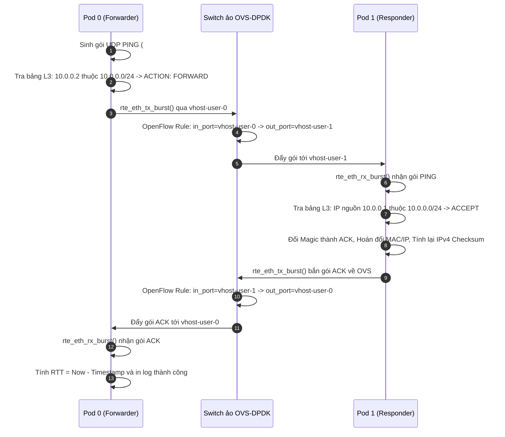

# K8s-DPDK-L3-Bridge: Giao tiếp Hai chiều Giữa 2 Pod qua Switch ảo OVS-DPDK

Dự án này được thiết kế nhằm xây dựng, thử nghiệm và làm chủ công nghệ **mạng hiệu năng cao (High-Performance Networking)** trong môi trường **Kubernetes**, kết hợp sức mạnh của **DPDK (Data Plane Development Kit)** và **Open vSwitch (OVS-DPDK)** để xử lý và chuyển mạch gói tin ở tầng mạng (Layer 3) với độ trễ cực thấp (Sub-millisecond latency) và thông lượng vượt trội.

---

## 📌 Mục lục
1. [Mục tiêu và Bối cảnh Kỹ thuật](#1-mục-tiêu-và-bối-cảnh-kỹ-thuật)
2. [Kiến trúc Tổng thể Hệ thống](#2-kiến-trúc-tổng-thể-hệ-thống)
3. [Các Khái niệm Cốt lõi Cần Nắm](#3-các-khái-niệm-cốt-lõi-cần-nắm)
4. [Vòng đời Gói tin (Packet Life Cycle)](#4-vòng-đời-gói-tin-packet-life-cycle)
5. [Cấu trúc Thư mục Dự án](#5-cấu-trúc-thư-mục-dự-án)
6. [Chi tiết Kỹ thuật Các Module Mã nguồn](#6-chi-tiết-kỹ-thuật-các-module-mã-nguồn)
7. [Tối ưu hóa Vị trí Lưu trữ tại /home/app](#7-tối-ưu-hóa-vị-trí-lưu-trữ-tại-homeapp)
8. [Hướng dẫn Chạy Thực tế Từng Bước](#8-hướng-dẫn-chạy-thực-tế-từng-bước)
9. [Xử lý Sự cố & Câu hỏi Thường gặp (FAQ)](#9-xử-lý-sự-cố--câu-hỏi-thường-gặp-faq)

---

## 1. Mục tiêu và Bối cảnh Kỹ thuật

### 1.1. Vấn đề của mạng Kubernetes truyền thống
Trong mạng Kubernetes tiêu chuẩn (sử dụng Flannel, Calico, hoặc kube-proxy dựa trên iptables/IPVS):
- Mọi gói tin gửi giữa các Pod đều phải đi qua **Linux Kernel Network Stack**.
- Quá trình này gây ra nhiều lần **sao chép bộ nhớ (Memory Copy)**, **ngắt phần cứng (Hardware Interrupts)** và **chuyển ngữ cảnh (Context Switch)** giữa User-space và Kernel-space.
- Giới hạn thông lượng thường chỉ đạt vài trăm ngàn gói tin mỗi giây (kpps), không đáp ứng được các ứng dụng viễn thông 5G (UPF), xử lý giao dịch tài chính tốc độ cao hoặc trung tâm dữ liệu AI/HPC.

### 1.2. Giải pháp của dự án này
- **Bypass hoàn toàn Linux Kernel:** Sử dụng thư viện **DPDK** để đưa việc xử lý gói tin lên thẳng Userspace thông qua cơ chế Polling (PMD - Poll Mode Driver).
- **Cơ chế vhost-user:** Hai Pod kết nối trực tiếp vào switch ảo **OVS-DPDK** trên Host thông qua Unix Domain Sockets và bộ nhớ chia sẻ Hugepages.
- **Bảng chuyển mạch tĩnh Layer 3 (Static L3 Forwarding/ACL):** Mỗi Pod tích hợp bảng luật LPM (Longest Prefix Match) để quyết định `FORWARD` hoặc `DROP` gói tin dựa trên địa chỉ IP.
- **Xác thực truyền thông hai chiều:** Pod 0 gửi gói tin kiểm thử (`PING_REQ`), OVS-DPDK chuyển mạch, Pod 1 tiếp nhận, đảo địa chỉ và gửi gói phản hồi (`ACK_RESP`) ngược lại cho Pod 0 để đo đạc thời gian khứ hồi (RTT).

---

## 2. Kiến trúc Tổng thể Hệ thống

```text
+------------------------------------------+        +------------------------------------------+
|            Pod 0: pod0-forwarder         |        |          Pod 1: pod1-responder           |
|                                          |        |                                          |
|  +------------------------------------+  |        |  +------------------------------------+  |
|  |       Bảng Luật L3 (routes.conf)   |  |        |  |       Bảng Luật L3 (routes.conf)   |  |
|  |   - 10.0.0.0/24: FORWARD           |  |        |  |   - 10.0.0.0/24: FORWARD           |  |
|  |   - Default: DROP                  |  |        |  |   - Default: DROP                  |  |
|  +------------------------------------+  |        |  +------------------------------------+  |
|  | main.c (Sinh gói + Fwd + Chờ ACK)  |  |        |  | main.c (Nhận gói + Swap + Bắn ACK) |  |
|  +------------------------------------+  |        |  +------------------------------------+  |
|  |        common/ (dpdk_init, utils)  |  |        |  |        common/ (dpdk_init, utils)  |  |
|  +------------------------------------+  |        |  +------------------------------------+  |
|                     |                    |        |                     |                    |
|             DPDK virtio-user0            |        |             DPDK virtio-user0            |
+---------------------+--------------------+        +---------------------+--------------------+
                      |                                                   |
               (Unix Socket)                                       (Unix Socket)
     /var/run/openvswitch/vhost-user-0                   /var/run/openvswitch/vhost-user-1
                      |                                                   |
+---------------------+---------------------------------------------------+--------------------+
| Host / Node Network:                                                                         |
|                                 Open vSwitch (OVS-DPDK)                                      |
|                                    Bridge: br-dpdk                                           |
|                                                                                              |
|    [Port: vhost-user-0]  <========= OpenFlow Forwarding =========>  [Port: vhost-user-1]     |
|    (dpdkvhostuserclient)                                             (dpdkvhostuserclient)   |
+----------------------------------------------------------------------------------------------+
```

---

## 3. Các Khái niệm Cốt lõi Cần Nắm

### 3.1. DPDK (Data Plane Development Kit)
DPDK là một bộ thư viện nguồn mở của Intel/Linux Foundation giúp tăng tốc xử lý gói tin mạng:
- **EAL (Environment Abstraction Layer):** Tầng trừu tượng hóa phần cứng, cấp phát CPU core affinity và quản lý bộ nhớ.
- **PMD (Poll Mode Driver):** Thay vì đợi ngắt phần cứng (interrupt-driven), DPDK chạy vòng lặp chủ động kiểm tra hàng đợi (polling loop), loại bỏ hoàn toàn độ trễ ngắt.
- **Mempool & Mbuf (`rte_mbuf`):** Quản lý vùng đệm gói tin cố định trong bộ nhớ, không tốn chi phí cấp phát động (`malloc`/`free`) khi mạng hoạt động.

### 3.2. Hugepages (Bộ nhớ trang lớn)
- Thông thường hệ điều hành Linux quản lý bộ nhớ bằng các trang (pages) có kích thước 4 KB.
- Với lưu lượng hàng triệu gói tin, bảng dịch trang (TLB - Translation Lookaside Buffer) của CPU sẽ liên tục bị quá tải (TLB Miss).
- **Hugepages (2 MB hoặc 1 GB):** Giảm kích thước bảng TLB xuống hàng ngàn lần, giúp CPU truy cập thẳng vào vùng đệm gói tin ở tốc độ tối đa. Dự án này cấp phát **1024 trang 2MB (2GB RAM)**.

### 3.3. vhost-user & Virtio-user
- **vhost-user:** Giao thức chia sẻ bộ nhớ (shared memory) giữa các tiến trình Userspace thông qua Unix Domain Socket.
- **Virtio-user:** Một card mạng ảo do DPDK tạo ra bên trong Pod, kết nối trực tiếp với socket vhost-user của OVS trên Host mà không cần kernel can thiệp.

### 3.4. LPM (Longest Prefix Match)
- Giải thuật tìm kiếm địa chỉ IP chuẩn của các Router mạng.
- Khi gói tin đến, thuật toán sẽ so sánh địa chỉ IP đích với các subnet trong bảng luật. Subnet nào có độ dài prefix lớn nhất (ví dụ `/24` ưu tiên hơn `/16`) sẽ quyết định hành vi.

---

## 4. Vòng đời Gói tin (Packet Life Cycle)

### Kịch bản 1: Luồng gửi thành công và nhận ACK (Forward & Reply)


### Kịch bản 2: Luồng chặn gói tin vi phạm (Drop Scenario)
- Nếu Pod 0 phát một gói tin tới địa chỉ không được phép (ví dụ `192.168.99.10`):
  - Pod 0 tra cứu bảng LPM -> Không khớp dải `10.0.0.0/24` -> Khớp luật mặc định `0.0.0.0/0 DROP`.
  - Hàm `rte_pktmbuf_free()` được gọi ngay tại chỗ, tăng bộ đếm `tx_dropped_l3`.
  - **Không có gói tin nào bị đẩy ra OVS**, tiết kiệm 100% tài nguyên CPU và đường truyền mạng.

---

## 5. Cấu trúc Thư mục Dự án

```text
K8s-DPDK-L3-Bridge/
├── CMakeLists.txt                  # Cấu hình build CMake chuẩn hóa cho toàn dự án
├── compile_commands.json           # Symlink tới build/compile_commands.json cho VSCode
├── common/                         # THƯ MỤC DÙNG CHUNG (Hạ tầng DPDK & Bảng luật L3)
│   ├── dpdk_init.c / .h            # Khởi tạo EAL, mempool, port virtio-user & queues
│   ├── l3_table.c / .h             # Giải thuật tra cứu LPM và nạp file routes.conf
│   └── pkt_utils.h                 # Bóc tách header, swap địa chỉ, tính checksum, in log
├── pod0-forwarder/                 # ỨNG DỤNG POD 0 (Forwarder / Sender)
│   ├── main.c                      # Logic Pod 0: Sinh gói PING + Tra bảng L3 + Chờ ACK
│   ├── routes.conf                 # Bảng luật chuyển mạch L3 của Pod 0
│   └── Dockerfile                  # Đóng gói image pod0:latest
├── pod1-responder/                 # ỨNG DỤNG POD 1 (Responder / Echo-ACK)
│   ├── main.c                      # Logic Pod 1: Nhận gói + Tra bảng L3 + Swap IP/MAC + Bắn ACK
│   ├── routes.conf                 # Bảng luật chuyển mạch L3 của Pod 1
│   └── Dockerfile                  # Đóng gói image pod1:latest
├── manifests/                      # KUBERNETES MANIFESTS & CẤU HÌNH OVS
│   ├── ovs-setup.sh                # Script tạo switch br-dpdk và 2 vhost-user ports
│   ├── pod0.yaml                   # Manifest triển khai Pod 0
│   └── pod1.yaml                   # Manifest triển khai Pod 1
├── scripts/                        # BỘ SCRIPTS TỰ ĐỘNG HÓA
│   ├── 00_setup_app_env.sh         # Khởi tạo /home/app, cài K3s, K9s, Docker daemon, cấp Hugepages
│   ├── 01_setup_host.sh            # Cài đặt và cấu hình dịch vụ openvswitch-switch-dpdk
│   ├── 02_setup_ovs.sh             # Thiết lập OVS-DPDK switch ảo
│   ├── 03_build_all.sh             # Biên dịch toàn bộ mã nguồn C bằng CMake
│   ├── 04_build_docker.sh          # Build 2 Docker images và nạp vào K3s store
│   ├── 05_deploy_k8s.sh            # Triển khai 2 Pod lên K3s
│   └── 06_verify_traffic.sh        # Kiểm tra log trao đổi 2 chiều thời gian thực
├── tests/                          # UNIT TEST TỰ ĐỘNG
│   └── test_l3_table.c             # Kiểm thử offline bảng luật L3 (chạy không cần root)
└── third_party/
    └── dpdk-24.11/                 # Thư viện DPDK 24.11 đã biên dịch sẵn trong workspace
```

---

## 6. Chi tiết Kỹ thuật Các Module Mã nguồn

### 6.1. `common/dpdk_init.c` & `common/dpdk_init.h`
Đóng gói toàn bộ hàng trăm dòng cấu hình DPDK phức tạp vào duy nhất một hàm khởi tạo:
```c
struct rte_mempool *init_dpdk_subsystem(int argc, char **argv, uint16_t *port_id, int *eal_consumed);
```
- Gọi `rte_eal_init()` để khởi tạo CPU cores và virtual device (`virtio_user`).
- Cấp phát `rte_pktmbuf_pool_create` với 8191 buffers cố định.
- Cấu hình port: 1 RX queue (1024 descriptors), 1 TX queue (1024 descriptors).
- Khởi động port và bật chế độ Promiscuous mode.

### 6.2. `common/l3_table.c` & `common/l3_table.h`
- Quản lý bảng định tuyến tĩnh bằng cấu trúc `rte_lpm`:
  ```c
  l3_action_t l3_table_lookup(struct l3_table *table, rte_be32_t dst_ip);
  ```
- **Xử lý đặc biệt cho Default Route (`0.0.0.0/0`):** Do hàm `rte_lpm_add()` của DPDK chỉ chấp nhận prefix `1 <= depth <= 32`, luật `/0` được quản lý riêng qua trường `default_action`, đảm bảo không bị lỗi `-EINVAL`.

### 6.3. `common/pkt_utils.h`
Cung cấp các inline function siêu nhanh:
- `parse_ipv4_packet()`: Trích xuất an toàn `eth_hdr`, `ip_hdr`, `udp_hdr` và `test_payload`.
- `swap_l2_l3_addresses()`: Đảo ngược MAC nguồn/đích và IP nguồn/đích chỉ trong vài chu kỳ CPU.
- `recalculate_ipv4_checksum()`: Tính lại IP checksum qua hàm `rte_ipv4_cksum()`.

---

## 7. Tối ưu hóa Vị trí Lưu trữ tại `/home/app`

Do phân vùng root (`/`) trên máy chỉ còn trống **~8.9 GB**, việc cài đặt Docker và Kubernetes thông thường sẽ nhanh chóng làm tràn ổ đĩa hệ thống. Dự án giải quyết triệt để vấn đề này bằng cách tận dụng phân vùng **`/home` (còn trống 97 GB)**:

```text
/home/app/
├── docker-data/          # data-root của Docker (toàn bộ images, build layers)
├── k8s-data/             # data-dir của K3s (database, pod volumes, manifests)
└── bin/                  # Nơi đặt binary k9s, kubectl
```

- **Docker (`/etc/docker/daemon.json`):** Cấu hình `"data-root": "/home/app/docker-data"`.
- **K3s Server:** Chạy với tham số `--data-dir=/home/app/k8s-data`.
- **Lợi ích:** Không tốn bất kỳ 1 MB nào của phân vùng root `/`, an toàn tuyệt đối cho hệ điều hành.

---

## 8. Hướng dẫn Chạy Thực tế Từng Bước

### Bước 1: Thiết lập Môi trường Host & OVS-DPDK (Chỉ cần chạy 1 lần)
Mở terminal tại thư mục dự án và chạy với quyền root:

```bash
# 1. Cài đặt Docker, K3s, K9s tại /home/app và cấp 2GB Hugepages
sudo bash scripts/00_setup_app_env.sh

# 2. Cài đặt và kích hoạt dịch vụ OVS-DPDK
sudo bash scripts/01_setup_host.sh

# 3. Tạo switch ảo br-dpdk và 2 cổng vhost-user
sudo bash scripts/02_setup_ovs.sh
```

### Bước 2: Biên dịch Mã nguồn & Chạy Unit Test
Bạn có thể chạy ở quyền user thông thường:

```bash
# Biên dịch cả 2 ứng dụng DPDK bằng CMake
bash scripts/03_build_all.sh

# Chạy thử unit test offline kiểm tra bảng luật L3
./build/test_l3_table
```

### Bước 3: Đóng gói Docker Images
```bash
# Build 2 images: pod0:latest và pod1:latest và nạp vào K3s store
bash scripts/04_build_docker.sh
```

### Bước 4: Triển khai lên Kubernetes
```bash
# Deploy Pod 1 (Responder) trước, sau đó deploy Pod 0 (Forwarder)
bash scripts/05_deploy_k8s.sh
```

### Bước 5: Kiểm tra Kết quả Trao đổi Hai chiều
```bash
# Xem log giao tiếp hai chiều thời gian thực
bash scripts/06_verify_traffic.sh
```

*Hoặc quan sát trực quan bằng K9s Dashboard:*
```bash
k9s
```
*(Trong giao diện K9s: Dùng phím mũi tên chọn `dpdk-pod0` hoặc `dpdk-pod1`, nhấn phím `l` để xem luồng log trực tiếp).*

---

## 9. Xử lý Sự cố & Câu hỏi Thường gặp (FAQ)

### Q1: Tại sao Pod không nhận được socket `/var/run/openvswitch/vhost-user-X`?
- **Nguyên nhân:** File socket do OVS tạo ra có quyền sở hữu của user `openvswitch`.
- **Cách xử lý:** Chạy lệnh cấp quyền:
  ```bash
  sudo chmod 777 /var/run/openvswitch/*
  ```

### Q2: Làm sao để kiểm tra số trang Hugepages đang có?
Chạy lệnh:
```bash
grep -i huge /proc/meminfo
```
Đảm bảo dòng `HugePages_Total` hiển thị ít nhất `1024` (loại 2048 kB).

### Q3: Muốn dừng và xóa toàn bộ Pod để test lại thì làm thế nào?
Chạy lệnh:
```bash
kubectl delete pod dpdk-pod0 dpdk-pod1 --force --grace-period=0
```

---

## 👨‍💻 Thông tin Tác giả & Giấy phép
- **Dự án:** K8s-DPDK-L3-Bridge
- **Môi trường thử nghiệm:** Ubuntu 24.04 LTS | DPDK 24.11 | Open vSwitch 3.3.4 | K3s & K9s.
- **Giấy phép:** Open-source theo giấy phép BSD-3-Clause (tương thích giấy phép gốc của DPDK).
