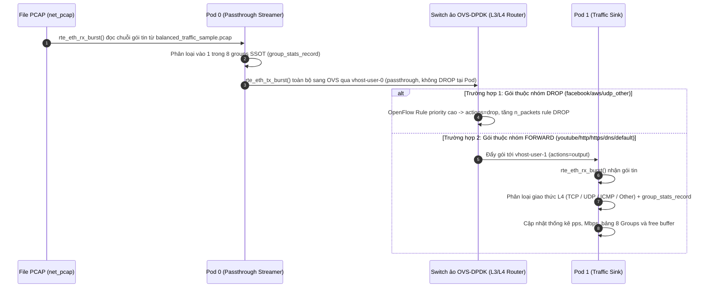

# K8s-DPDK-L3-Bridge: Chuyển mạch và Định tuyến Gói tin L3 qua OVS-DPDK trong Kubernetes

Dự án này được thiết kế nhằm xây dựng, thử nghiệm và đánh giá công nghệ **mạng hiệu năng cao (High-Performance Networking)** trong môi trường **Kubernetes**, kết hợp sức mạnh của **DPDK (Data Plane Development Kit)** và **Open vSwitch (OVS-DPDK)** để xử lý, phân loại và chuyển mạch lưu lượng mạng thực tế (PCAP Replay) ở tầng Layer 3 với độ trễ cực thấp và thông lượng hàng triệu gói tin mỗi giây (Mpps).

---

## 📌 Mục lục
1. [Kiến trúc Tổng thể Hệ thống](#1-kiến-trúc-tổng-thể-hệ-thống)
2. [Vòng đời Gói tin (Packet Life Cycle)](#2-vòng-đời-gói-tin-packet-life-cycle)
3. [Cấu trúc Thư mục Dự án](#3-cấu-trúc-thư-mục-dự-án)
4. [Hướng dẫn Chạy Thực tế Từng Bước](#4-hướng-dẫn-chạy-thực-tế-từng-bước)

---


## 1. Kiến trúc Tổng thể Hệ thống

```text
+------------------------------------------+        +------------------------------------------+
|            Pod 0: dpdk-pod0              |        |             Pod 1: dpdk-pod1             |
|       (PCAP Streamer & Passthrough)      |        |       (High-Speed Traffic Sink)          |
|                                          |        |                                          |
|  [File PCAP: balanced_traffic_sample.pcap] |      |                                          |
|                 │                        |        |                                          |
|       DPDK Port 0 (net_pcap)             |        |                                          |
|                 ▼                        |        |                                          |
|  +------------------------------------+  |        |  +------------------------------------+  |
|  |  Group Stats (8 groups SSOT):      |  |        |  |  Group Stats (8 groups SSOT):      |  |
|  |  3 DROP (fb/aws/udp) | 5 FORWARD   |  |        |  |  chỉ còn 5 nhóm FORWARD          |  |
|  +------------------------------------+  |        |  +------------------------------------+  |
|  | TX toàn bộ sang Port 1 (Virtio)    |  |        |  | main.c (pps/Mbps + groups + HW)  |  |
|  +------------------------------------+  |        |  +------------------------------------+  |
|  |     common/ (dpdk_init, group_stats)|  |        |  |     common/ (dpdk_init, group_stats)|  |
|  +------------------------------------+  |        |  +------------------------------------+  |
|                 │                        |        |                    ▲                     |
|       DPDK Port 1 (virtio-user0)         |        |         DPDK Port 0 (virtio-user0)       |
+----------------─┼────────────────────────+        +────────────────────┼─────────────────────+
                  │                                                      │
            (Unix Socket)                                          (Unix Socket)
  /var/run/openvswitch/vhost-user-0                      /var/run/openvswitch/vhost-user-1
                  │                                                      │
+─────────────────┼──────────────────────────────────────────────────────┼─────────────────────+
| Pod: ovs-dpdk (Switch ảo OVS-DPDK chạy trong Pod - Zero-copy Shared Memory)                  |
|                                     Bridge: br-dpdk                                          |
|              Bảng route L3/L4 từ manifests/ovs_flows.conf (SSOT, 8 groups)                   |
|    [Port: vhost-user-0]  <==== OpenFlow L3/L4 Routing (DROP fb/aws/udp, FWD còn lại) ===>  [Port: vhost-user-1]     |
|    (dpdkvhostuserclient)                                             (dpdkvhostuserclient)   |
+----------------------------------------------------------------------------------------------+
```

---


## 2. Vòng đời Gói tin (Packet Life Cycle)



---

## 3. Cấu trúc Thư mục Dự án

```text
K8s-DPDK-L3-Bridge/
├── CMakeLists.txt                  # Cấu hình build CMake chuẩn hóa cho toàn dự án
├── build/compile_commands.json       # (Sinh tự động) cấu hình Language Server cho VSCode / IDE
├── common/                         # THƯ MỤC DÙNG CHUNG (Hạ tầng DPDK & Bảng luật SSOT)
│   ├── dpdk_init.c / .h            # Khởi tạo EAL, mempool, cấu hình port virtio-user & queues
│   ├── group_stats.c / .h          # Module phân loại và thống kê theo 8 Groups SSOT
│   ├── group_stats_table.h         # Bảng luật C sinh tự động từ manifests/ovs_flows.conf
│   ├── l3_table.c / .h             # Giải thuật tra cứu LPM legacy
│   ├── hw_stats.c / .h             # In thống kê phần cứng cổng mạng (imissed/oerrors)
│   └── pkt_utils.h                 # Đồng hồ monotonic get_current_time_ns cho thống kê chu kỳ
├── data/                           # DỮ LIỆU GÓI TIN THỬ NGHIỆM
│   └── balanced_traffic_sample.pcap # File PCAP dùng runtime (mount vào Pod 0 qua hostPath)
├── docs/                           # TÀI LIỆU HƯỚNG DẪN BÁO CÁO & THUYẾT TRÌNH
│   └── SLIDE_REPORT_GUIDE.md       # Dàn bài slide, kịch bản báo cáo và số liệu đối chứng cho Mentor
├── pod0-forwarder/                 # ỨNG DỤNG POD 0 (PCAP Replayer & Passthrough)
│   ├── main.c                      # Logic Pod 0: Đọc PCAP + Thống kê 8 Groups + Passthrough sang OVS
│   └── Dockerfile                  # Đóng gói image pod0:latest
├── pod1-responder/                 # ỨNG DỤNG POD 1 (Traffic Sink & Inspector)
│   ├── main.c                      # Logic Pod 1: Nhận gói từ OVS + Thống kê 8 Groups + Đối soát lọc gói
│   └── Dockerfile                  # Đóng gói image pod1:latest
├── manifests/                      # KUBERNETES MANIFESTS & CẤU HÌNH OVS
│   ├── ovs_flows.conf              # Single Source of Truth (SSOT) cho 8 Groups và 16 Filter Rules
│   ├── ovs-pod.yaml                # Manifest Pod OVS-DPDK chạy vSwitch ảo trong K8s
│   ├── ovs-setup.sh                # Script tạo switch br-dpdk và nạp flows tự động từ ovs_flows.conf
│   ├── pod0.yaml                   # Manifest triển khai Pod 0 (mount PCAP data, hugepages, ovs socket)
│   └── pod1.yaml                   # Manifest triển khai Pod 1 (mount hugepages, ovs socket)
├── scripts/                        # BỘ SCRIPTS TỰ ĐỘNG HÓA TỪ A-Z
│   ├── 00_setup_app_env.sh         # Khởi tạo /home/app, cài K3s, Docker data-root, cấp Hugepages
│   ├── 01_setup_host.sh            # (Legacy) Cài OVS trên Host — KHÔNG dùng nữa, OVS chạy trong Pod
│   ├── gen_group_table.sh          # Sinh mã C group_stats_table.h từ manifests/ovs_flows.conf
│   ├── 03_build_all.sh             # Sinh mã C và biên dịch toàn bộ bằng CMake
│   ├── 04_build_docker.sh          # Build 2 Docker images và nạp vào K3s image store
│   ├── 05_deploy_k8s.sh            # Triển khai toàn bộ cụm K8s (ovs-dpdk, pod0, pod1)
│   ├── 06_verify_traffic.sh        # Kiểm tra thống kê pps, throughput và bảng 8 Groups đối chứng E2E
│   └── 07_stop_k8s.sh              # Dừng toàn bộ Pods và dọn socket vhost-user tồn đọng
├── tests/                          # UNIT TEST TỰ ĐỘNG
│   └── test_l3_table.c             # Kiểm thử offline bảng luật L3 (chạy không cần quyền root)
└── third_party/
    └── dpdk-24.11/                 # Thư viện DPDK 24.11 đã biên dịch sẵn trong workspace
```

---

## 4. Hướng dẫn Chạy Thực tế Từng Bước

### Bước 1: Thiết lập Môi trường (Chỉ cần chạy 1 lần)
Mở terminal tại thư mục dự án và chạy với quyền root:

```bash
# 1. Cài đặt môi trường runtime (Docker, K3s, K9s) và cấp 2GB Hugepages
sudo bash scripts/00_setup_app_env.sh
```

> **Lưu ý kiến trúc hiện tại:** OVS-DPDK chạy **trong Pod** (`manifests/ovs-pod.yaml`), không còn chạy service trên Host. `scripts/01_setup_host.sh` là legacy của kiến trúc cũ — không chạy nữa (nếu service host còn active, stop để tránh xung đột socket: `sudo systemctl stop openvswitch-switch`). Bridge `br-dpdk` và flows được `ovs-pod` tự nạp từ `manifests/ovs_flows.conf` qua `manifests/ovs-setup.sh` khi khởi động.

### Bước 2: Biên dịch Mã nguồn & Chạy Unit Test
Chạy ở quyền user thông thường:

```bash
# Biên dịch cả 2 ứng dụng DPDK bằng CMake
bash scripts/03_build_all.sh

# Chạy unit test offline kiểm tra bảng luật L3
./build/test_l3_table
```

### Bước 3: Đóng gói Docker Images
```bash
# Build 2 images: pod0:latest và pod1:latest và nạp vào K3s image store
bash scripts/04_build_docker.sh
```

### Bước 4: Triển khai lên Kubernetes (đúng thứ tự OVS trước để giữ handshake vhost-user)
```bash
# Deploy ovs-dpdk trước, sau đó Pod 1 (Sink) và Pod 0 (Streamer)
bash scripts/05_deploy_k8s.sh
```

### Bước 5: Kiểm tra Thống kê & Hiệu năng Trao đổi
```bash
# Xem bảng route OVS, thống kê DPDK và bảng 8 Groups đối chứng E2E
bash scripts/06_verify_traffic.sh
```

### Dừng cụm khi không dùng
```bash
# Xóa 3 Pods và dọn socket vhost-user tồn đọng
bash scripts/07_stop_k8s.sh
```

*Hoặc quan sát trực quan bằng K9s Dashboard:*
```bash
k9s
```
*(Trong giao diện K9s: Dùng phím mũi tên chọn `dpdk-pod0` hoặc `dpdk-pod1`, nhấn phím `l` để theo dõi luồng log trực tiếp).*

---

