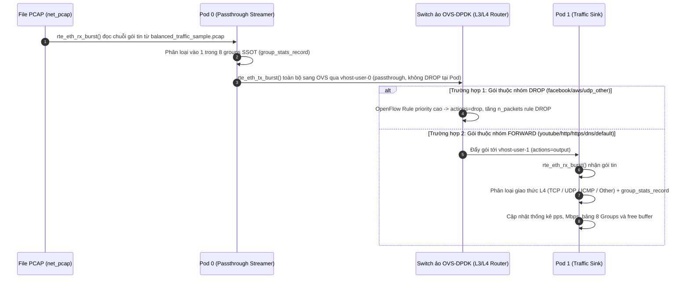
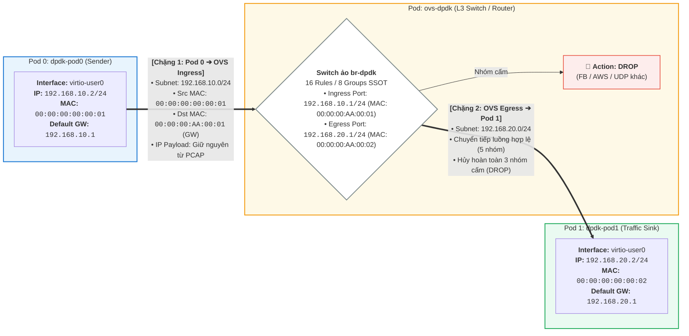

# K8s-DPDK-L3-Bridge: Chuyển mạch và Định tuyến Gói tin L3 qua OVS-DPDK trong Kubernetes

Dự án này được thiết kế nhằm xây dựng, thử nghiệm và đánh giá công nghệ **mạng hiệu năng cao (High-Performance Networking)** trong môi trường **Kubernetes**, kết hợp sức mạnh của **DPDK (Data Plane Development Kit)** và **Open vSwitch (OVS-DPDK)** để xử lý, phân loại và chuyển mạch lưu lượng mạng thực tế (PCAP Replay) ở tầng Layer 3 với độ trễ cực thấp và thông lượng hàng triệu gói tin mỗi giây (Mpps).

---

## 🎥 Video Demo Hoạt động Hệ thống

> **Mô tả:** Video thực nghiệm ghi lại quá trình triển khai cụm 3 Pods (`ovs-dpdk`, `dpdk-pod0`, `dpdk-pod1`), kiểm tra luồng định tuyến L3/L4 và đối chứng số liệu Throughput (pps, Mbps) cùng 8 nhóm luật SSOT thời gian thực.

<p align="center">
  <video src="docs/assets/demo_traffic_routing.webm" controls="controls" width="100%">
    Trình duyệt không hỗ trợ xem trực tiếp. Bạn có thể mở video tại <code>docs/assets/demo_traffic_routing.webm</code>.
  </video>
</p>

---

## 📌 Mục lục
1. [Kiến trúc Tổng thể Hệ thống](#1-kiến-trúc-tổng-thể-hệ-thống)
2. [Vòng đời Gói tin (Packet Life Cycle)](#2-vòng-đời-gói-tin-packet-life-cycle)
3. [Cấu trúc Thư mục Dự án](#3-cấu-trúc-thư-mục-dự-án)
4. [Hướng dẫn Chạy Thực tế Từng Bước](#4-hướng-dẫn-chạy-thực-tế-từng-bước)

---


## 1. Kiến trúc Tổng thể Hệ thống

```text
                  +-------------------------------------------------------------+
                  |  Kubernetes ConfigMap: ovs-flows (ovs_flows.conf - 8 Groups)|
                  +-------------------------------------------------------------+
                                      │                                 │
                     mount /app/ovs_flows.conf         mount /app/ovs_flows.conf
                                      ▼                                 ▼
+------------------------------------------+        +------------------------------------------+
|            Pod 0: dpdk-pod0              |        |             Pod 1: dpdk-pod1             |
|       (PCAP Streamer & Passthrough)      |        |       (High-Speed Traffic Sink)          |
|                                          |        |                                          |
| [File PCAP: balanced_traffic_sample.pcap]|        | [Runtime Parser: nạp luật lúc startup]   |
|                 │                        |        |                 │                        |
|       DPDK Port 0 (net_pcap)             |        |                 ▼                        |
|                 ▼                        |        |  +------------------------------------+  |
|  +------------------------------------+  |        |  |  Group Stats (8 groups SSOT):      |  |
|  |  Group Stats (8 groups SSOT):      |  |        |  |  chỉ còn 5 nhóm FORWARD            |  |
|  |  3 DROP (fb/aws/udp) | 5 FORWARD   |  |        |  +------------------------------------+  |
|  +------------------------------------+  |        |  | main.c (pps/Mbps + groups + HW)    |  |
|  | TX toàn bộ sang Port 1 (Virtio)    |  |        |  +------------------------------------+  |
|  +------------------------------------+  |        |  | common/ (dpdk_init, flow_table,    |  |
|  | common/ (dpdk_init, flow_table,    |  |        |  |          group_stats)              |  |
|  |          group_stats)              |  |        |  +------------------------------------+  |
|  +------------------------------------+  |        +------------------------------------------+
+------------------------------------------+                            ▲
                 │                                                      │
       DPDK Port 1 (virtio-user0)                         DPDK Port 0 (virtio-user0)
+----------------▼------------------------------------------------------│----------------------------------------+
|                                                                                                                |
| Pod: ovs-dpdk (Switch ảo OVS-DPDK chạy trong Pod - Zero-copy Shared Memory)                                    |
|                                     Bridge: br-dpdk                                                            |
|              Bảng route L3/L4 từ manifests/ovs_flows.conf (SSOT, 8 groups)                                     |
|    [Port: vhost-user-0]  <==== OpenFlow L3/L4 Routing (DROP fb/aws/udp, FWD còn lại) ===>  [Port: vhost-user-1]|
|    (dpdkvhostuserclient)                                             (dpdkvhostuserclient)                     |
+----------------------------------------------------------------------------------------------------------------+
```

---


## 2. Vòng đời Gói tin (Packet Life Cycle)

### 2.1. Sơ đồ Tuần tự Giao tiếp (Sequence Diagram)


```mermaid
sequenceDiagram
    autonumber
    participant PCAP as File PCAP (net_pcap)
    participant P0 as Pod 0 (Passthrough Streamer)
    participant OVS as Switch ảo OVS-DPDK (L3/L4 Router)
    participant P1 as Pod 1 (Traffic Sink)

    PCAP->>P0: rte_eth_rx_burst() đọc chuỗi gói tin từ balanced_traffic_sample.pcap
    P0->>P0: Phân loại vào 1 trong 8 groups SSOT (group_stats_record)
    P0->>OVS: rte_eth_tx_burst() toàn bộ sang OVS qua vhost-user-0 (passthrough, không DROP tại Pod)

    alt Trường hợp 1: Gói thuộc nhóm DROP (facebook/aws/udp_other)
        OVS->>OVS: OpenFlow Rule priority cao -> actions=drop, tăng n_packets rule DROP
    else Trường hợp 2: Gói thuộc nhóm FORWARD (youtube/http/https/dns/default)
        OVS->>P1: Đẩy gói tới vhost-user-1 (actions=output)
        P1->>P1: rte_eth_rx_burst() nhận gói tin
        P1->>P1: Phân loại giao thức L4 (TCP / UDP / ICMP / Other) + group_stats_record
        P1->>P1: Cập nhật thống kê pps, Mbps, bảng 8 Groups và free buffer
    end
```

### 2.2. Sơ đồ Luồng Đi & Biến đổi Gói tin (Chi tiết từ L2 MAC đến L3 IP & TTL)

Sơ đồ thể hiện đầy đủ định danh **Địa chỉ MAC (Tầng L2)** và **Địa chỉ IP (Tầng L3)** của từng nút mạng/cổng giao tiếp, cùng sự biến đổi header của gói tin qua từng chặng theo số liệu thực nghiệm:


```mermaid
flowchart LR
    %% 1. Node Pod 0
    subgraph P0 ["Pod 0: dpdk-pod0 (Sender)"]
        direction TB
        N0["<b>Interface:</b> virtio-user0<br><b>IP:</b> <code>192.168.10.2/24</code><br><b>MAC:</b> <code>00:00:00:00:00:01</code><br><b>Default GW:</b> <code>192.168.10.1</code>"]
    end

    %% 2. Node OVS-DPDK
    subgraph OVS ["Pod: ovs-dpdk (L3 Switch / Router)"]
        direction TB
        ROUTER{"<b>Switch ảo br-dpdk</b><br>16 Rules / 8 Groups SSOT<br>• Ingress Port: <code>192.168.10.1/24</code> (MAC: 00:00:00:AA:00:01)<br>• Egress Port: <code>192.168.20.1/24</code> (MAC: 00:00:00:AA:00:02)"}
        DROP["🚫 <b>Action: DROP</b><br>(FB / AWS / UDP khác)"]
        ROUTER -- "Nhóm cấm" --> DROP
    end

    %% 3. Node Pod 1
    subgraph P1 ["Pod 1: dpdk-pod1 (Traffic Sink)"]
        direction TB
        N1["<b>Interface:</b> virtio-user0<br><b>IP:</b> <code>192.168.20.2/24</code><br><b>MAC:</b> <code>00:00:00:00:00:02</code><br><b>Default GW:</b> <code>192.168.20.1</code>"]
    end

    %% Luồng đi và Biến đổi Header
    N0 ==> |"<b>[Chặng 1: Pod 0 ➔ OVS Ingress]</b><br>• Subnet: 192.168.10.0/24<br>• Src MAC: <code>00:00:00:00:00:01</code><br>• Dst MAC: <code>00:00:00:AA:00:01</code> (GW)<br>• IP Payload: Giữ nguyên từ PCAP"| ROUTER

    ROUTER ==> |"<b>[Chặng 2: OVS Egress ➔ Pod 1]</b><br>• Subnet: 192.168.20.0/24<br>• Chuyển tiếp luồng hợp lệ (5 nhóm)<br>• Hủy hoàn toàn 3 nhóm cấm (DROP)"| N1

    %% Styling
    style P0 fill:#e8f4fd,stroke:#1976d2,stroke-width:2px
    style OVS fill:#fef9e7,stroke:#f39c12,stroke-width:2px
    style P1 fill:#eafaf1,stroke:#27ae60,stroke-width:2px
    style DROP fill:#fdedec,stroke:#e74c3c,stroke-width:1.5px
    style ROUTER fill:#ffffff,stroke:#7f8c8d,stroke-width:2px
```

---

### 2.3. Bảng Phân Tích Định Tuyến & Cấu Hình L3 4 Đầu Mạng

| Thành phần mạng | Tên Interface | Địa chỉ IP (L3) | Địa chỉ MAC (L2) | Default Gateway | Vai trò mạng |
| :--- | :--- | :--- | :--- | :--- | :--- |
| **Pod 0 (Forwarder)** | `virtio-user0` | `192.168.10.2/24` | `00:00:00:00:00:01` | `192.168.10.1` | Trạm phát lưu lượng (Subnet A) |
| **OVS Ingress Port** | `vhost-user-0` | `192.168.10.1/24` | `00:00:00:AA:00:01` | *N/A (Gateway)* | Cổng tiếp nhận / Ingress Gateway |
| **OVS Egress Port** | `vhost-user-1` | `192.168.20.1/24` | `00:00:00:AA:00:02` | *N/A (Gateway)* | Cổng định tuyến / Egress Gateway |
| **Pod 1 (Responder)** | `virtio-user0` | `192.168.20.2/24` | `00:00:00:00:00:02` | `192.168.20.1` | Trạm đích / Traffic Sink (Subnet B) |

---

### 2.4. Diễn giải Luồng Gói tin Đi qua 3 Khối

1. **Tại Pod 0 (`dpdk-pod0`)**:
   * Cổng mạng `virtio-user0` được gán IP `192.168.10.2/24` và MAC `00:00:00:00:00:01`, định tuyến qua Gateway OVS `192.168.10.1`.
   * Gói tin thực tế từ file `balanced_traffic_sample.pcap` được nạp vào qua **DPDK Port 0 (`net_pcap`)**.
   * Pod 0 bóc tách header L3/L4 ghi nhận thống kê vào bảng 8 nhóm SSOT (**Offered Load**).
   * Chế độ **Transparent Passthrough**: Pod 0 chuyển tiếp nguyên vẹn gói tin qua **DPDK Port 1 (`virtio-user0`)** sang OVS qua bộ nhớ chia sẻ Hugepages.
2. **Tại Switch ảo OVS-DPDK (`br-dpdk`)**:
   * OVS tiếp nhận gói tin tại **Cổng Ingress `vhost-user-0`** (`192.168.10.1/24`, MAC `00:00:00:AA:00:01`).
   * Gói tin đi vào bảng định tuyến **OpenFlow L3/L4** (đối chiếu IP đích `nw_dst` và Port `tp_dst`):
     * Nếu thuộc nhóm cấm (Facebook, AWS, UDP khác) $\rightarrow$ Gói tin bị **DROP** (hủy bỏ ngay tại switch, thu hồi mbuf, counters DROP tăng).
     * Nếu thuộc nhóm cho phép (YouTube, Web HTTP/HTTPS, DNS, Default) $\rightarrow$ OVS thực hiện chuyển tiếp định tuyến sang **Cổng Egress `vhost-user-1`** (`192.168.20.1/24`, MAC `00:00:00:AA:00:02`).
3. **Tại Pod 1 (`dpdk-pod1`)**:
   * Cổng mạng `virtio-user0` được gán IP `192.168.20.2/24` và MAC `00:00:00:00:00:02`, Gateway `192.168.20.1`.
   * Pod 1 đón nhận gói tin từ Hugepages thông qua **DPDK Port 0 (`virtio-user0`)**.
   * Bóc tách IP Header để thống kê: chứng minh nhóm cấm bị lọc sạch (bằng 0), chỉ còn 5 nhóm FORWARD.
   * Tính toán Throughput (pps, Mbps) và hoàn trả bộ nhớ (`rte_pktmbuf_free`). Gói tin kết thúc vòng đời tại đây.

---

## 3. Cấu trúc Thư mục Dự án

```text
K8s-DPDK-L3-Bridge/
├── CMakeLists.txt                  # Cấu hình build CMake chuẩn hóa cho toàn dự án
├── build/compile_commands.json       # (Sinh tự động) cấu hình Language Server cho VSCode / IDE
├── common/                         # THƯ MỤC DÙNG CHUNG (Hạ tầng DPDK & Bảng luật SSOT)
│   ├── dpdk_init.c / .h            # Khởi tạo EAL, mempool, cấu hình port virtio-user & queues
│   ├── flow_table.c / .h           # Module nạp & phân tích bảng luật lúc startup (Runtime Parser)
│   ├── group_stats.c / .h          # Module phân loại và thống kê theo 8 Groups SSOT
│   ├── l3_table.c / .h             # Giải thuật tra cứu LPM legacy
│   ├── hw_stats.c / .h             # In thống kê phần cứng cổng mạng (imissed/oerrors)
│   └── pkt_utils.h                 # Đồng hồ monotonic get_current_time_ns cho thống kê chu kỳ
├── data/                           # DỮ LIỆU GÓI TIN THỬ NGHIỆM
│   └── balanced_traffic_sample.pcap # File PCAP dùng runtime (mount vào Pod 0 qua hostPath)
├── docs/                           # TÀI LIỆU HƯỚNG DẪN BÁO CÁO & THUYẾT TRÌNH
│   ├── assets/                     # Thư mục lưu trữ media (video demo_traffic_routing.webm)
│   └── SLIDE_REPORT_GUIDE.md       # Dàn bài slide, kịch bản báo cáo và số liệu đối chứng cho Mentor
├── pod0-forwarder/                 # ỨNG DỤNG POD 0 (PCAP Replayer & Passthrough)
│   ├── main.c                      # Logic Pod 0: Đọc PCAP + Thống kê 8 Groups + Passthrough sang OVS
│   └── Dockerfile                  # Đóng gói image pod0:latest
├── pod1-responder/                 # ỨNG DỤNG POD 1 (Traffic Sink & Inspector)
│   ├── main.c                      # Logic Pod 1: Nhận gói từ OVS + Thống kê 8 Groups + Đối soát lọc gói
│   └── Dockerfile                  # Đóng gói image pod1:latest
├── manifests/                      # KUBERNETES MANIFESTS & CẤU HÌNH OVS
│   ├── ovs_flows.conf              # Single Source of Truth (SSOT) cho 8 Groups và 16 Filter Rules
│   ├── ovs-pod.yaml                # Manifest Pod OVS-DPDK chạy vSwitch ảo trong K8s
│   ├── ovs-setup.sh                # Script tạo switch br-dpdk và nạp flows tự động từ ovs_flows.conf
│   ├── pod0.yaml                   # Manifest triển khai Pod 0 (mount PCAP data, ConfigMap, hugepages, ovs socket)
│   └── pod1.yaml                   # Manifest triển khai Pod 1 (mount ConfigMap, hugepages, ovs socket)
├── scripts/                        # BỘ SCRIPTS TỰ ĐỘNG HÓA TỪ A-Z
│   ├── 00_setup_app_env.sh         # Khởi tạo /home/app, cài K3s, Docker data-root, cấp Hugepages
│   ├── 01_setup_host.sh            # (Legacy) Cài OVS trên Host — KHÔNG dùng nữa, OVS chạy trong Pod
│   ├── 03_build_all.sh             # Biên dịch toàn bộ bằng CMake
│   ├── 04_build_docker.sh          # Build 2 Docker images và nạp vào K3s image store
│   ├── 05_deploy_k8s.sh            # Triển khai toàn bộ cụm K8s (tự động nạp ConfigMap từ ovs_flows.conf, ovs-dpdk, pod0, pod1)
│   ├── 06_verify_traffic.sh        # Kiểm tra thống kê pps, throughput và bảng 8 Groups đối chứng E2E
│   ├── 07_stop_k8s.sh              # Dừng toàn bộ Pods và dọn socket vhost-user tồn đọng
│   └── update_flows.sh             # Tự động cập nhật bảng luật từ ovs_flows.conf và nạp lại vào K8s/OVS/Pods
├── tests/                          # UNIT TEST TỰ ĐỘNG
│   ├── test_l3_table.c             # Kiểm thử offline bảng luật L3 (chạy không cần quyền root)
│   └── test_flow_table.c           # Kiểm thử offline bộ Runtime Parser & đối sánh luật (không cần root)
└── third_party/
    └── dpdk-24.11/                 # Thư viện DPDK 24.11 đã biên dịch sẵn trong workspace
```

---

## 4. Hướng dẫn Chạy Thực tế Từng Bước

### Bước 1: Thiết lập Môi trường (Chỉ cần chạy 1 lần)
Mở terminal tại thư mục dự án và chạy với quyền root:

```bash
# 1. Cài đặt môi trường runtime (Docker, K3s, K9s) và cấp 2GB Hugepages
sudo bash scripts/00_setup_app_env.sh
```

> **Lưu ý kiến trúc hiện tại:** OVS-DPDK chạy **trong Pod** (`manifests/ovs-pod.yaml`), không còn chạy service trên Host. `scripts/01_setup_host.sh` là legacy của kiến trúc cũ — không chạy nữa (nếu service host còn active, stop để tránh xung đột socket: `sudo systemctl stop openvswitch-switch`). Bridge `br-dpdk` và flows được `ovs-pod` tự nạp từ `manifests/ovs_flows.conf` qua `manifests/ovs-setup.sh` khi khởi động.

### Bước 2: Biên dịch Mã nguồn & Chạy Unit Test
Chạy ở quyền user thông thường:

```bash
# Biên dịch cả 2 ứng dụng DPDK bằng CMake
bash scripts/03_build_all.sh

# 1. Chạy unit test offline kiểm thử Runtime Flow Table Parser (8 groups, 16 rules)
./build/test_flow_table

# 2. Chạy unit test offline kiểm thử bảng tra cứu L3 LPM
./build/test_l3_table
```

### Bước 3: Đóng gói Docker Images
```bash
# Build 2 images: pod0:latest và pod1:latest và nạp vào K3s image store
bash scripts/04_build_docker.sh
```

### Bước 4: Triển khai lên Kubernetes (đúng thứ tự OVS trước để giữ handshake vhost-user)
```bash
# Deploy ovs-dpdk trước, sau đó Pod 1 (Sink) và Pod 0 (Streamer)
bash scripts/05_deploy_k8s.sh
```

### Bước 5: Kiểm tra Thống kê & Hiệu năng Trao đổi
```bash
# Xem bảng route OVS, thống kê DPDK và bảng 8 Groups đối chứng E2E
bash scripts/06_verify_traffic.sh
```

### 💡 Cập nhật Bảng luật SSOT lúc Vận hành (Không cần Rebuild)
Nhờ kiến trúc **Runtime Parser + Kubernetes ConfigMap**, khi bạn muốn thay đổi chính sách lọc gói (ví dụ: đổi IP của một nhóm, thêm dải IP mới hoặc đổi hành động DROP/FORWARD):
1. **Sửa cấu hình:** Chỉnh sửa **duy nhất** file [manifests/ovs_flows.conf](manifests/ovs_flows.conf).
2. **Chạy script đồng bộ tự động 1 lệnh duy nhất:**
   ```bash
   bash scripts/update_flows.sh
   ```
   *(Script sẽ tự động nạp ConfigMap lên K8s, hot-reload flow vào switch ảo OVS-DPDK và khởi động lại 2 Pods mà hoàn toàn **không cần biên dịch lại code hay build lại Docker image**).*

### Dừng cụm khi không dùng
```bash
# Xóa 3 Pods và dọn socket vhost-user tồn đọng
bash scripts/07_stop_k8s.sh
```

*Hoặc quan sát trực quan bằng K9s Dashboard:*
```bash
k9s
```
*(Trong giao diện K9s: Dùng phím mũi tên chọn `dpdk-pod0` hoặc `dpdk-pod1`, nhấn phím `l` để theo dõi luồng log trực tiếp).*

---

